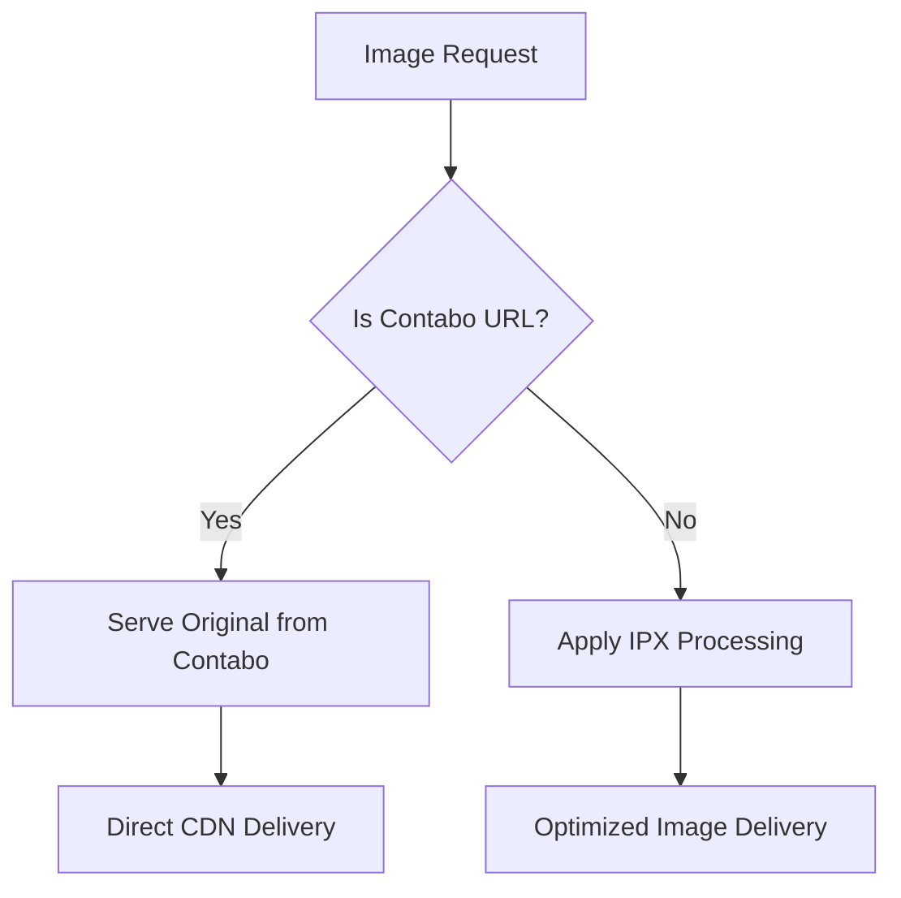

# Contabo Object Storage + IPX Compatibility Solution

## 🎯 **Problem Statement**

The project uses Contabo Object Storage for image hosting, but IPX (Image Processing eXtended) from @nuxt/image may not work properly with external S3-compatible storage services due to:

- **CORS Issues**: IPX needs to fetch images from external domains
- **Authentication**: Contabo may require specific headers
- **Custom Endpoints**: IPX may not be fully compatible with S3-compatible services
- **Network Latency**: Real-time processing can be slow with external storage

## ✅ **Solution Implemented**

### **Option 1: Disable IPX for Contabo Images (IMPLEMENTED)**

We've configured the system to skip IPX processing for Contabo images while maintaining optimization for other image sources.

## 🔧 **Technical Implementation**

### **1. Nuxt Configuration**

```typescript
// nuxt.config.ts
image: {
  domains: ['localhost', 's3.amazonaws.com', 'usc1.contabostorage.com'],
  // Note: We handle Contabo image optimization skip in component logic
  // instead of using providers to avoid import resolution issues
  // ... rest of config
}
```

### **2. Component Logic Updates**

#### **CustomImage.vue**
- Added `isContaboImage` computed property to detect Contabo URLs
- Use conditional rendering: regular `` for Contabo, `<NuxtImg>` for others
- Contabo images bypass IPX processing entirely

```vue
<!-- Contabo Images: Use regular img tag (no IPX processing) -->

/>

<!-- Non-Contabo Images: Use NuxtImg for IPX processing -->
<NuxtImg
  v-else-if="shouldLoad && !isContaboImage"
  :src="props.src"
  :quality="isSlowNetwork ? Math.min(quality - 20, 60) : quality"
  :format="supportsWebP ? 'webp' : 'auto'"
  <!-- ... other props -->
/>
```

#### **Performance Composables**
- Updated `usePerformanceOptimization.js` to skip optimization for Contabo URLs
- Updated `usePerformanceMonitor.js` to return default settings for Contabo images

## 🚀 **Benefits**

### **✅ Advantages**
- **Reliability**: No IPX processing errors for Contabo images
- **Performance**: Direct serving from Contabo CDN
- **Compatibility**: Works with any S3-compatible storage
- **Fallback Safe**: Other images still get IPX optimization

### **⚠️ Trade-offs**
- **No Real-time Optimization**: Contabo images served as-is
- **Bandwidth**: Larger file sizes for Contabo images
- **Format Conversion**: No automatic WebP conversion for Contabo images

## 📊 **Current Image Flow**



## 🔍 **Monitoring & Testing**

### **How to Test**
1. **Contabo Images**: Should load directly without IPX processing
2. **Other Images**: Should still get IPX optimization
3. **Network Tab**: Check for absence of `/_ipx/` URLs for Contabo images

### **Expected Behavior**
- Contabo images: `https://usc1.contabostorage.com/...` (direct)
- Other images: `/_ipx/q_80,f_webp/...` (processed)

## 🛠️ **Alternative Solutions (Not Implemented)**

### **Option 2: Custom Provider**
Create a custom provider for Contabo with specific handling.

### **Option 3: Pre-processing**
Process images during upload to create multiple sizes.

## 📝 **Maintenance Notes**

- **Monitor**: Watch for any IPX errors in console
- **Performance**: Track image loading times for Contabo vs other sources
- **Updates**: Review when updating @nuxt/image module
- **Storage**: Consider pre-processing if bandwidth becomes an issue

## 🔗 **Related Files**

- `nuxt.config.ts` - Main configuration
- `components/CustomImage.vue` - Image component logic
- `composables/usePerformanceOptimization.js` - Performance optimization
- `composables/usePerformanceMonitor.js` - Performance monitoring
- `server/utils/urlTransform.js` - URL transformation utilities

## 📋 **Future Considerations**

1. **Pre-processing Pipeline**: Consider processing images during upload
2. **CDN Integration**: Evaluate dedicated image CDN services
3. **Hybrid Approach**: Mix of pre-processed and real-time optimization
4. **Performance Monitoring**: Track actual impact on user experience
